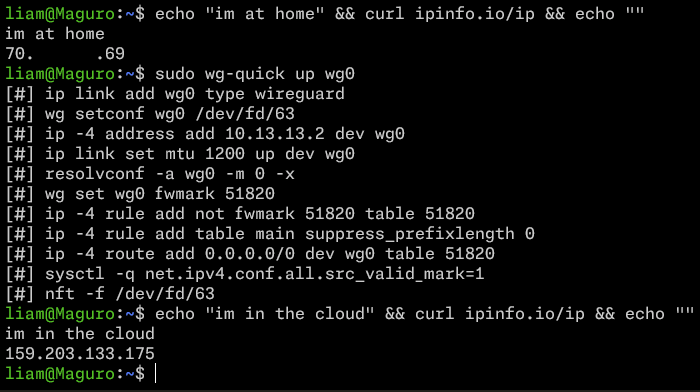
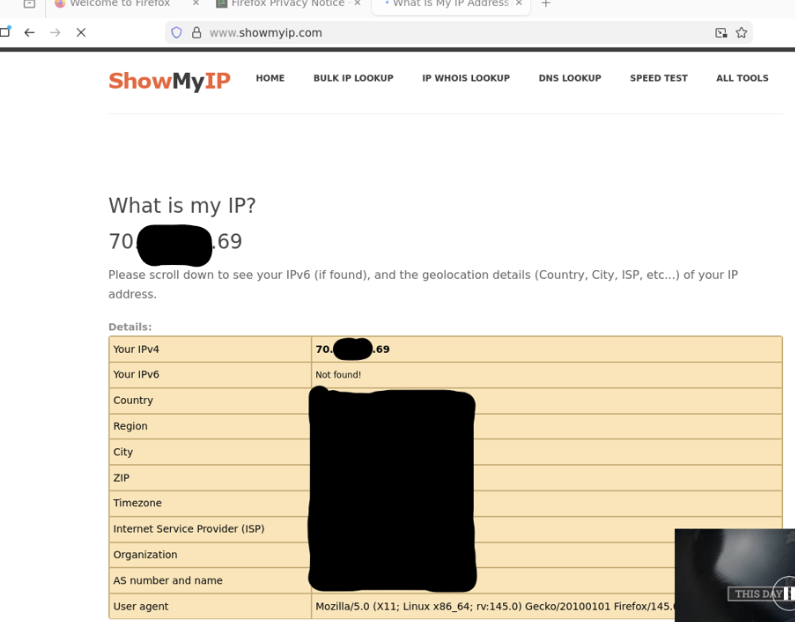
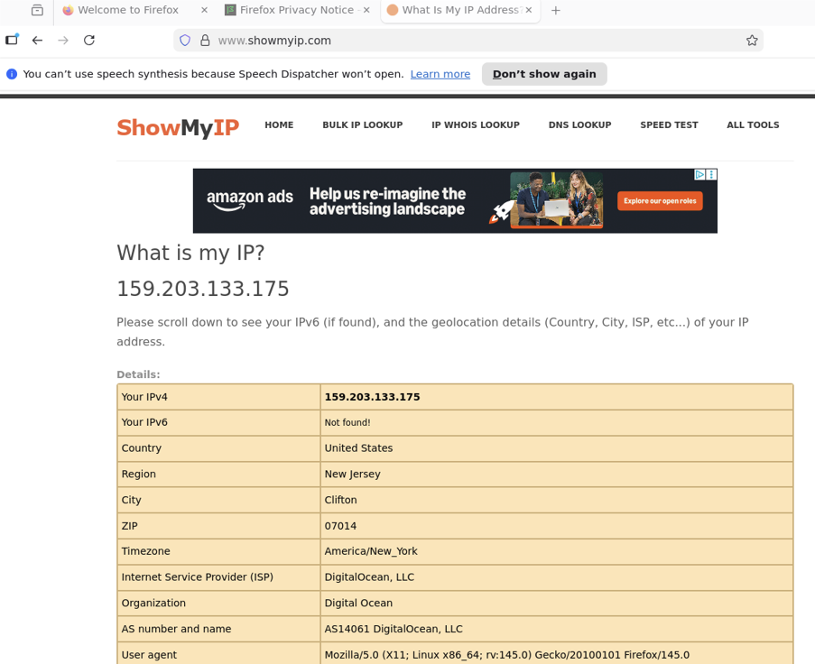

# Wireguard Lab Documentation

## 1. Preparing the Server for Wireguard
- Create a DigitalOcean account [here](https://m.do.co/c/d33d59113ab6).
- Create a droplet with at least 1 GB of memory.
- Update the system with `apt update && apt upgrade`
- Install docker engine ([Ubuntu Example](./docker.md)).

## 2. Installing and Configuring the Wireguard Server
- In the droplet with docker, create a directory for wireguard.
- In that directory, create `compose.yml` file with these contents taken from [the official github](https://github.com/linuxserver/docker-wireguard) (Note that the droplet's IP must be filled in for services.wireguard.environment:SERVERURL):

```
services:
  wireguard:
    image: lscr.io/linuxserver/wireguard:latest
    container_name: wireguard
    cap_add:
      - NET_ADMIN
      - SYS_MODULE #optional
    environment:
      - PUID=1000
      - PGID=1000
      - TZ=Etc/UTC
      - SERVERURL=159.203.133.175 #optional
      - SERVERPORT=51820 #optional
      - PEERS=1 #optional
      - PEERDNS=auto #optional
      - INTERNAL_SUBNET=10.13.13.0 #optional
      - ALLOWEDIPS=0.0.0.0/0 #optional
      - PERSISTENTKEEPALIVE_PEERS= #optional
      - LOG_CONFS=true #optional
    volumes:
      - ./config:/config
      - /lib/modules:/lib/modules #optional
    ports:
      - 51820:51820/udp
    sysctls:
      - net.ipv4.conf.all.src_valid_mark=1
    restart: unless-stopped
```
- Start the container in detached mode with `docker compose up -d`

## 3. Installing and Configuring the Wireguard Client
- On the computer you want to connect from, install wireguard (and resolvconf if not already). Example commands for Ubuntu:

```
$ sudo apt update && sudo apt upgrade
$ sudo apt install wireguard resolvconf
```
- The configuration file you need is in the droplet's filesystem at `$wireguard_dir/config/peer1/peer1.conf`. Log into the droplet and copy-paste the contents into your client machine at `/etc/wireguard/wg0.conf`. Here is an example configuration:

```
[Interface]
Address = 10.13.13.2
PrivateKey = Redacted_Base64
ListenPort = 51820
DNS = 10.13.13.1

[Peer]
PublicKey = Redacted_Base64
PresharedKey = Redacted_Base64
Endpoint = 159.203.133.175:51820
AllowedIPs = 0.0.0.0/0
```

## 4. Testing Functionality
 Once the configuration is imported, test its functionality by requesting your IP before and after activating the connection:
```
$ curl ipinfo.io/ip
$ sudo wg-quick up wg0
$ curl ipinfo.io/ip
```
You should see output like this:



If you wish to use a website, you should also be able to see other details change, such as your location:



